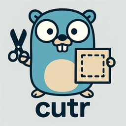

# cutr

<div align="center">
  
</div>

**Fast, minimal project scaffolder for developers** – Point it at a template, answer prompts, get a working project.

## Why cutr?

Setting up new projects shouldn't involve copying boilerplate, hunting for templates, or manually replacing placeholder text. cutr solves this by:

- **Zero configuration required** – Just run it on any template directory or Git repo
- **Interactive prompts** – Guided setup with validation, defaults, and help text
- **Template everything** – File contents, names, and directory structures
- **Automation built-in** – Pre/post hooks for dependency installation and setup
- **Developer-focused** – Built for speed and simplicity, not feature bloat

## Features

- **Flexible sources**: Local directories, Git URLs (`https://`, `ssh://`, `gh://owner/repo`)
- **Rich prompts**: String, choice, number, boolean with validation and defaults
- **Template engine**: Go templates in file contents and paths (`{{.variable}}`)
- **Hooks system**: Run commands before/after generation with access to variables
- **Smart handling**: Binary files copied as-is, permissions preserved
- **Safe by default**: Missing template variables cause failures (no silent errors)
- **Clean output**: Skips `.git`, `cutr.yaml`, and configurable ignore patterns

## Installation

**Go install (recommended):**

```bash
go install github.com/yarlson/cutr@latest
```

**From source:**

```bash
git clone https://github.com/yarlson/cutr
cd cutr
go build -o cutr
sudo mv cutr /usr/local/bin/  # optional: add to PATH
```

**Requirements:** Go 1.24+

## Usage

```bash
cutr <template> [output_dir]
```

### Basic Examples

```bash
# Use a local template directory
cutr ./my-template ./new-project

# Clone and use a Git repository
cutr https://github.com/user/template ./new-project

# GitHub shorthand
cutr gh://user/template ./new-project

# Output to current directory (default)
cutr ./template
```

### Interactive Flow

```bash
$ cutr examples/go-cli-cobra ./my-cli

🏗️  Project Scaffolding

◇  Project name
│  my-awesome-cli

◇  Go module name
│  github.com/myuser/my-awesome-cli

◇  Author name
│  John Developer

# ... more prompts based on cutr.yaml ...

◇  Pre generation hooks executed

◇  Template rendering complete

◇  Post generation hooks executed

✓  Project scaffolded
```

## Template Configuration

Templates use a `cutr.yaml` file to define variables, validation, and hooks:

```yaml
name: "my-template"
description: "Example project template"
version: "1.0.0"

variables:
  project_name:
    type: string
    prompt: "Project name"
    default: "my-project"
    pattern: "^[a-z][a-z0-9-]*$"
    help: "Lowercase with optional hyphens"

  language:
    type: choice
    prompt: "Programming language"
    choices: ["Go", "Python", "JavaScript"]
    default: "Go"

  port:
    type: number
    prompt: "Server port"
    default: 8080

  enable_auth:
    type: boolean
    prompt: "Enable authentication?"
    default: false

hooks:
  pre_generation:
    - "echo 'Setting up {{.project_name}}...'"

  post_generation:
    - "npm install"
    - "git init"
    - "echo 'Project ready!'"

template:
  ignore_patterns:
    - "*.tmp"
    - ".DS_Store"
  keep_permissions: true
```

### Variable Types

- **`string`** - Text input with optional regex pattern validation
- **`choice`** - Select from predefined options
- **`number`** - Numeric input with validation
- **`boolean`** - Yes/No confirmation

### Template Syntax

Use Go template syntax in file contents and names:

```go
// main.go
package main

import "fmt"

func main() {
    fmt.Println("Welcome to {{.project_name}}!")
    {{- if .enable_auth}}
    fmt.Println("Authentication enabled")
    {{- end}}
}
```

File/directory names:

```
{{.project_name}}/
├── {{.project_name}}.go
├── config/
│   └── {{.environment}}.yaml
└── README.md
```

## Template Sources

cutr supports multiple template sources:

| Format           | Example                            | Description                 |
| ---------------- | ---------------------------------- | --------------------------- |
| Local path       | `./templates/api`                  | Directory on filesystem     |
| HTTPS Git        | `https://github.com/user/template` | Public Git repository       |
| SSH Git          | `git@github.com:user/template.git` | Git over SSH                |
| GitHub shorthand | `gh://user/template`               | Expands to GitHub HTTPS URL |

## Examples

The `examples/` directory contains ready-to-use templates:

```bash
# Create a Go CLI application with Cobra
cutr examples/go-cli-cobra ./my-cli
cd my-cli
go run . --help
```

See [examples/README.md](examples/README.md) for detailed information about available templates.

## Help

```bash
# Show usage
cutr --help
cutr -h

# Get help during prompts
# Press Ctrl+C to cancel at any time
```

## Development Status

cutr is **production ready** with a stable API. It's actively maintained and used for scaffolding Go projects, web applications, and development tools.

**Roadmap:**

- Additional variable types (multi-choice, password)
- Template validation and testing tools
- Improved error messages and debugging
- Template registry/marketplace

## Contributing

Contributions welcome! Please:

1. Fork the repository
2. Create a feature branch
3. Add tests for new functionality
4. Ensure all tests pass: `go test ./...`
5. Submit a pull request

**Areas that need help:**

- Additional template examples
- Documentation improvements
- Cross-platform testing
- Performance optimizations

## License

MIT License - see [LICENSE](LICENSE) file for details.

---

Built with ❤️ for developers who value simplicity and speed.
